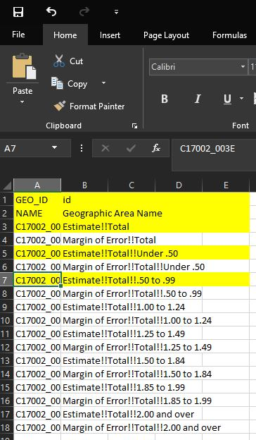
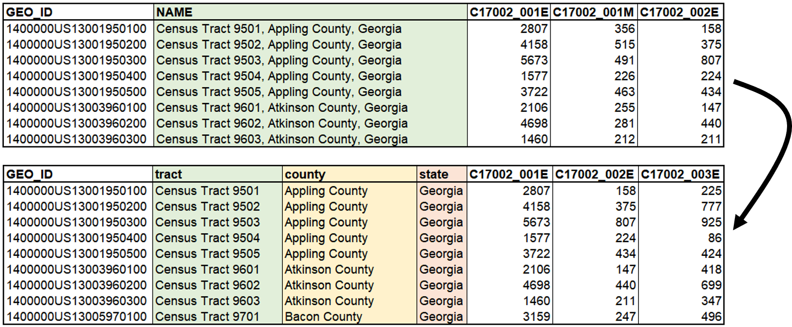
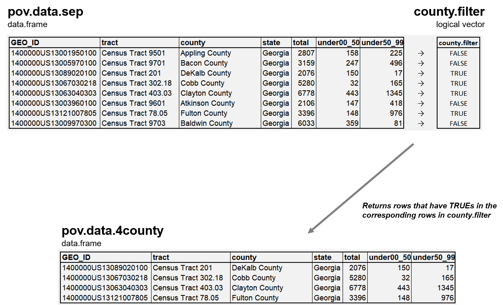

```{r setup, include=FALSE}
knitr::opts_chunk$set(echo = TRUE)
```

This lab will guide you through (1) reading in data from your computer, (2) cleaning the data. In specific, materials in this document include:

Functions       Tasks   
--------        --------------
`getwd()`       Print the current working directory           
`setwd()`       Set the working directory to the specified path 
`dir()`         Returns a character vector of names of files and folders in the current wd
`read.csv()`    Read in files with '.csv' extensions
`head()`        Return the first few elements or rows (usually 6)
`data.frame()`  Create a data.frame object           
`colnames()`    Retrieve or set the column names of a matrix-like object
`is.na()`       Identify which elements are missing (i.e., NA or NaN)
`min()`         Return the minimum of a vector 
`max()`         Return the maximum of a vector 
`mean()`        Return the mean value of a vector 
`median()`      Return the median value of a vector 
`summary()`     Return central tendency statistics for the provided R object
`separate()`    Turn a single character column into multiple columns (tidyverse)
`drop_na()`     Drop NAs in a column (tidyverse)
`filter()`      Filter a column by conditions and return rows that meet the conditions (tidyverse)
`group_by()`    Allow the following operation to be performed by group. Use `ungroup()` to remove grouping (tidyverse)
`summarise()`   Create a new dataframe that has the group variable and the outputs of operations by group (tidyverse). 
--------        --------------

## 0. Setting up working environment and downloading tidyverse
> When you open R-studio, your R session is *located in* one of the folders in your computer. This folder is called working directory. When you tell R to read a data using `read.csv()` function, R starts looking for the file *in* the working directory. If your file is not there, R cannot find the file. You need to tell R where to find the file that you want to read. 

Let's see where your R session is currently located by using `getwd()` function. 'wd' here stands for working directory.

```{r}
getwd() 
```

Above is the folder your R session is currently in. Note that the path shown above is the current working directory of my (Xiaofan's) computer. Your current working directory may be different. Now, let's tell R the location of the working directory that you want to work in (which is where the data is located) by using `setwd()` function. 

**Note that the folder names are separated by `/`, not `\`. If you copied and pasted a directory path from windows file explorer, you will need to change `\` to `/`.**

```{r eval = FALSE}
#Window users may reference: "C:/Users/cod/Desktop/PhD Files/GRA & GTA/GTA/CP6025 Fall 2021/Week 2/Lab2"
setwd("/Users/xiaofanliang/Dropbox (GaTech)/GT_Academics/CP6025_TA/Lab/Lab2/") 
```

To see what files are in the new working directory, you can use `dir()` function.
```{r}
dir() # When there is no argument inside the parenthesis, dir() returns the names of files or folders in the working directory. The output below is showing files and folders in my (Gabriel's) computer, and they may be different from yours.
```

You can also use the choose.dir() function to change your directory.

```{r eval = FALSE}
setwd(choose.dir())
```

Every time you open R-studio, you are initiating a new R session, and the working directory will revert back to where it first was. You will need to set the working directory to an appropriate folder every time you open R-studio. If you see "ACSDT5Y2017.C17002-Data.csv", you are in the right folder! 

Let's download required packages in R. In addition to the functions in base R, we will use `separate` function from "tidyverse" package. Then, we bring in the packages and read the data in.

```{r, eval = FALSE}
# Install required packages
install.packages("tidyverse") 
```

```{r echo=T, message=FALSE, warning=FALSE, results='hide'}
# Call the packages using library()
library(tidyverse)
```

Since we confirmed that R is in the right folder and can locate the file, let's read it using `read.csv()` function and assign it to an R object called `pov.data`. We can view the first few rows of the dataset using `head()`. 

```{r}
# setwd("insert the path to the folder where data file is located")
pov.data <- read.csv("ACSDT5Y2017.C17002-Data.csv")
head(pov.data)
```

Another way to examine the data is by using `str()` function. Note that `str()` function not only shows what variables are in the data but also how many rows there are and what types of data each of the variables are.

```{r}
str(pov.data) # prints the dimension of the data in "the number of rows, the number of columns" format
```

Now the R object `pov.data` contains the data from "ACSDT5Y2017.C17002-Data.csv". `pov.data` is a dataframe (similar to an Excel spreadsheet) with `r nrow(pov.data)` rows and `r ncol(pov.data)` columns (a.k.a. variables). For this exercise, we will only use one of them - the variable named `C17002_001E`. **This variable represents RATIO OF INCOME TO POVERTY LEVEL for all census tracts in Georgia state.**

In R, `pov.data$C17002_001E` means "Give me the variable named `C17002_001E` in the dataset called `pov.data`." Here, `$` operator extracts parts of an R object. If used with a data.frame, it extracts *columns.*

```{r}
head(pov.data$C17002_001E)
```

&nbsp;

# 1. Data Cleaning

> In the real world, data you need to analyze will always come in messy or incomplete forms. Even data from extremely systematized sources, such as the U.S. Census Bureau, often requires some amount of work to 'get the data ready'. This process of getting the data ready is often called data cleaning.

The data we just read has a few issues that need to be cleaned if we were to use it for any statistical analysis. 

1. There are many columns other than the ones we are interested in. We want to exclude the variables that are not interesting to us.

2. We need to extract the names of counties from the variable named 'NAME'. We need to separate the variable into three pieces.

3. The names of the variable are not intuitive. We need to replace these codes with something more meaningful.

4. The data contains data for all counties in Georgia while we are interested in only four counties around Atlanta (Fulton, DeKalb, Clayton, and Cobb). We need to exclude other counties from the data.

5. The data we downloaded contains the total population and the number of those who are under poverty. We need to convert this data into *percentage*.

6. Finally, there are some Census Tracts that have zero population (To see this, try `min(pov.data$C17002_001E)`), which will create an issue when we divide the number of people in poverty by population to calculate the percent under poverty (e.g., 0/0 is `NaN` in R, which stands for 'Not a Number'). These values need to be excluded from the data.

&nbsp;

##### *Let's fix these six issues one by one!*  

&nbsp;
&nbsp;

#### 1.1. Selecting variables (i.e., filtering out columns that are not needed)

**We are interested in the proportion of people whose income is lower than the poverty line and whether that is different in different counties** but there are many other columns containing data that we do not need. To find out which ones are the variables we need, we must know what "C17002_001E", "C17002_002E", etc. mean. We need to see the data dictionary that came together with the data file. The variables we need are (1) the two ID variables for each Census Tract (i.e., GEO_ID and NAME), (2) total population, (3) number of people whose income is under 50% of the poverty line, and (4) number of people whose income is between 50% and 99% of the poverty line. The names of the variable that we are interested in are highlighted in yellow in the image below.



Before we exclude variables and retain only those that we need, let's recap how to do subsetting in R.

<div class="alert alert-info">

<strong> Subsetting and indexing a vector or a dataframe: </strong> Subsetting a vector or a dataframe in R can be done using square brackets `[]`. When you put `[]` after a vector or a dataframe, **it means you are about to extract some parts of it.** If it is a vector (which is one dimension), you only need to specify one index to parse it. See examples below.

```{r}
my.vec <- c(1,3,5,7,9,11)
my.vec[3] # This returns 5, which is in 3rd position of the vector
my.vec[c(TRUE, FALSE, FALSE, TRUE, TRUE, FALSE)] # this returns 1,7,9, those which are in position where TRUEs are. Think of TRUEs and FALSEs as filters. TRUEs let through the values being filtered. FALSEs block the values being filtered. As a result, you get values in a vector that are in the same position as TRUEs in the square bracket.
```

If it is a dataframe, which is 2-dimensional with rows and columns, you need to supply *two* indices to parse it, one for **rows** and one for **columns**. The format is like this: `dataframe[ index for row, index for column ]`. See examples below and read the comments (hashtags) carefully.

```{r}
my.df <- data.frame(a = c("a", "b", "c", "d"), 
                    b = c(1, 2, 3, 4), 
                    Avengers = c("Peter", "Natasha", "Hulk", "Thor"),
                    stringsAsFactors = FALSE)
my.df # See what the data.frame looks like before subsetting
my.df[1 , 3] # This returns the 1st row of the 3rd column, which is "Peter"
my.df[2:3 , 1] # This returns 2nd and 3rd rows of the first column, which are "b", "c"
my.df[ , "Avengers"] # This returns all rows in the column named "Avengers". If the row-part in the square bracket is empty, it means all rows. If columns-part in the square bracket is empty, it mean all columns.
my.df[c(FALSE, TRUE, FALSE, TRUE) , "Avengers"] # This will return the 2nd and 4th rows (which are where TRUEs are located) of the column "Avengers", which are Natasha and Thor. 
```

</div>

Now we know what variables we need to retain and how to subset a data frame. The code below is an R-way saying "Give me all rows (note the empty part before the comma in the square bracket!) and variables named GEO_ID, NAME, C17002_001E, C17002_002E, C17002_003E from a data.frame called `pov.data` and put it in `pov.data.var`." Note that if you don't assign the subsetted data.frame into an R object, it will simply print the subsetted data.frame in the console window and disappear. 

```{r}
pov.data.var <- pov.data[ , c("GEO_ID", "NAME", "C17002_001E", "C17002_002E", "C17002_003E") ] 
head(pov.data.var)
```

If you want to use tidyverse syntax, the following lines return the same outcome. 

```{r}
pov.data.var <- pov.data %>% select(c(GEO_ID, NAME, C17002_001E, C17002_002E, C17002_003E))
head(pov.data.var)
```

&nbsp;
&nbsp;


#### 1.2. Separating a variable at commas

**We want to compare poverty rate of different counties, and to do that we need a variable that tells us which county the given Census Tract falls into.** The name of the county is embedded in a variable called 'NAME'. Let's extract the county names from the variable. The 'NAME' is formatted in the following way: "Census Tract 9501, Appling County, Georgia". If we break it at every comma, we will have "Census Tract 9501", "Appling County", and "Georgia" all separated out, which can then be stored in three different variables. The schematic below illustrates the operation we want to do.



The `separate` function takes four arguments (arguments are what you supply to functions as inputs): (1) name of data, (2) name of variable to be parsed, (3) a list of columns to be created as the results, (4) and the character that will be used as the separator. *Notice that there is a space after comma in* `sep = ", "`*. If we forget this space, all values in the newly created variable will be preceded by a space because R treats a space as a character too if it is in a character string.*

**Note that `separate` function is part of `tidyverse` package. You need to bring in the package in order to use this function.**

```{r}
# Separate 'NAME' variable into three variables at a comma and a space
pov.data.sep <- separate(
  data = pov.data.var,                  # 1st: specify the data.frame
  col = NAME,                           # 2nd: specify the name of the variable you want to parse
  into = c("tract", "county", "state"), # 3rd: a list of variable names that will be created as the result of parsing
  sep = ", ")                           # 4th: character string that will be used as the separator
                          
```

Same as before, you need to assign the output of `separate` function into an R object. Otherwise, the function will just print the output of the `separate` function in the console window and the output will disappear. Let's examine what `separate` function has produced.

```{r}
head(pov.data.sep)
```

The code worked perfectly! Now 'tract' variable contains only census tract ID, 'county' variable contains only county names, and so on.


&nbsp;
&nbsp;


#### 1.3. Changing the name of the variables

**The name of the variables are still in "C17002_001E" form, which is completely meaningless and a bit long. Let's give them shorter and interpretable names.** We can access the names of the variables in a dataframe using `colnames` function. 

```{r}
colnames(pov.data.sep)
```

We can see that the first 5 variables have acceptable names. It is the 5th through 7th variables that are the problems. Using the same technique for subsetting and indexing, let's give those problematic variables new names. The following code means "Replace the 5th, 6th, and 7th names in the list of variable names in the data.frame `pov.data.sep` with new names: total, under00_50, and under50_99"

```{r}
# Rename variables
colnames(pov.data.sep)[5:7] <- c("total", "under00_50", "under50_99")
head(pov.data.sep)
```

See that now the new names are applied to the data.frame and we can immediately understand what each of the variable represents.

The following tidyverse syntax achieves the same outcome. 

```{r}
#rerun the seperation to get the original column names before changes
pov.data.sep <- separate(data = pov.data.var, col = NAME, into = c("tract", "county", "state"), sep = ", ")  
# Rename variables. 
pov.data.sep <- pov.data.sep %>% rename(total = C17002_001E, under00_50 = C17002_002E, under50_99 = C17002_003E)
head(pov.data.sep)
```

&nbsp;
&nbsp;


#### 1.4. Selecting the four counties around Atlanta (i.e., filtering out rows that represent counties other than Fulton, DeKalb, Cobb, and Clayton County)

**Since we are interested in only Fulton, DeKalb, Clayton, and Cobb Counties, let's drop rows that contain data of other counties but keep all the columns.** What we want to do in a schematic is as follows:


We can use `%in%` operator to do the job. The `%in%` operator is used to check if elements belong to a vector. This `%in%` operator returns `TRUE` if the element we are checking (i.e., the thing on the left of `%in%`) is in the vector we are checking it against (i.e., the thing on the right side of `%in%`). See the example below:

```{r}
# Create a toy vector
my.vec <- c(1,2,3,10,20,30)
1 %in% my.vec # This returns one TRUE because there is 1 in my.vec
15 %in% my.vec # This returns FALSE because my.vec does not contain 15
c(2,3,40) %in% my.vec # This gives TRUE, TRUE, FALSE because the first two elements are in my.vec while the last isn't
```

The following code tests whether each element in `pov.data.sep$county` is in a vector of `c("Fulton County", "DeKalb County", "Cobb County", and "Clayton County")`, returns a vector of `TRUE`s and `FALSE`s, and stores it in an object called `county.filter`. 

If the first row of `pov.data.sep$county` is one of the four counties, `county.filter` gets `TRUE` as its first element. If the second row of `pov.data.sep$county` is NOT one of the four counties, the second element of `county.filter` gets `FALSE`, and so on. 

```{r echo=TRUE, paged.print=TRUE}
# Create a logical vector in which rows that have the four counties in 'county' column gets TRUE and otherwise FALSE
county.filter <- pov.data.sep$county %in% c("Fulton County", "DeKalb County", "Cobb County", "Clayton County")
county.filter # In this county.filter vector, there are as many elements as the number of rows in pov.data.sep
```

We can insert this logical vector `county.filter` into the *"row-part"* of the square bracket `[ , ]`. Remember that the left-side of comma in `[,]` **represents rows** and the right-side **represents columns**. If we write `pov.data.sep[county.filter , ]`, it is identical to writing `pov.data.sep[c(FALSE, TRUE, FALSE, ... , FALSE) , ]`, which means "give me all columns from `pov.data.sep` and rows in the corresponding locations as `TRUE`s in `county.filter`". As a result, you get a data.frame shown below.

```{r}
# Filter 'pov.data.sep' using 'county.filter'
pov.data.4county <- pov.data.sep[county.filter, ]

# Number of rows and columns after filtering
head(pov.data.4county)
```

We have reduced the number of rows from 1969 (before the filtering) to 519 (after the filtering) while maintaining the number of columns. 


<div class="alert alert-info">

Once you get more familiar with R, you don't need to create a `county.filter` first and then use it in the square bracket; you can simply put them all together in one line code. See below.

```{r}
# This code is ...
county.filter <- pov.data.sep$county %in% c("Fulton County", "DeKalb County", "Cobb County", "Clayton County")
pov.data.4county <- pov.data.sep[county.filter, ]

# Identical to ...
pov.data.4county <- pov.data.sep[pov.data.sep$county %in% c("Fulton County", "DeKalb County", "Cobb County", "Clayton County"), ]

```

You can use whichever works better for you.

Again, the tidyverse syntax to achieve the same outcome is the following: 
```{r}
pov.data.4county <- pov.data.sep %>% filter(county %in% c("Fulton County", "DeKalb County", "Cobb County", "Clayton County"))
```

</div>

&nbsp;
&nbsp;


#### 1.5. Calculating a new variable based on existing ones

The variable "total" is the total population of each Census Tract. The variable "under00_50" and "under50_99" are the number of people whose income is between 0 to 50% of the poverty line and 50% to 99% of the poverty line, respectively. Because what we want is **the proportion of people whose income is lower than the poverty line**, we first need to add "under00_50", and "under50_99" to calculate the total number of people under poverty line and, second, divide that number by the total population. 

Note that we are assigning the outcome of the calculation into a variable called `p.pov` which currently is NOT present in the data.frame. This is how we can create a **new** variable in a data.frame. 

```{r}
# Calculate percentages
pov.data.4county$p.pov <- (pov.data.4county$under00_50 + pov.data.4county$under50_99) / pov.data.4county$total
summary(pov.data.4county$p.pov)
```

The tidyverse syntax for the same outcome is the following:
```{r}
# Calculate percentages
pov.data.4county <- pov.data.4county %>% mutate(p.pov = (under00_50 + under50_99) / total)
summary(pov.data.4county$p.pov)
```

&nbsp;
&nbsp;

#### 1.6. Excluding NAs or NaNs

**We are almost there!** Notice that the summary function above shows that there are 5 `NA`'s in the newly created `p.pov` variable (to be specific, they are `NaN`s, not `NA`s but summary function doesn't distinguish the two). This is due to the Census Tract with 0 population. They are of no value to us because (1) there is no point analyzing poverty if there is no one living there and (2) `NA`s and `NaN`s can cause malfunction of some functions like `mean` (To see this, try `mean(c(1,2,3,NA))`). 

We can filter out `NA`s in the same way we filtered out counties in 1.5. This time, we will use `is.na()` function. This function takes a vector and returns `TRUE` to elements that are either `NA` or `NaN` and `FALSE` otherwise. **Because the function returns `TRUE` to `NA`s and `NaN`s, which are what we want to drop, we need to FLIP IT using a negation operator `!`.** For example, `!TRUE` is `FALSE` and `!FALSE` is `TRUE`.

`!is.na(pov.data.4county$p.pov)` is R-way of saying "Give me a logical vector that has `TRUE`s in places where there are `NA`s in `pov.data.4county$p.pov` and `FALSE`s otherwise and *FLIP IT*.

```{r}
# Filtering out NAs
na.filter <- !is.na(pov.data.4county$p.pov)
df.ready <- pov.data.4county[na.filter, ]
summary(df.ready)
```

The tidyverse syntax for the same outcome is the following:
```{r}
df.ready <- pov.data.4county %>% drop_na(p.pov)
summary(df.ready)
```

Can you see that the 5 `NA`s in the `p.pov` variable are no longer there? We have completed the data cleaning! 

# 2. Descriptive Statistics

Now the data is cleaned, we can calculate descriptive statistics value of our data. Let's use the `total` column as an example. The following codes return the  mean, median, minimum, and maximum value of the total population in our data. Noted that these functions require the column vector has no `NA`s. If your column vector has `NA`s, you can ask the function to ignore `NA`s by adding the argument `na.rm=T`, which sets remove `NA`s to TRUE.
```{r}
mean(df.ready$total) #mean(df.ready$total, na.rm=T)
median(df.ready$total)
min(df.ready$total)
max(df.ready$total)
```

Calculate mode is a bit complicated in R because the function `mode` returns internal storage mode of the object rather than the mathematical mode. Thus, we will create a `mode` function. What this `mode` function does is that it finds all the unique values in the given column vector and then find out which value has the highest count and return that value.  

```{r}
getmode <- function(v) {
   uniqv <- unique(v)
   uniqv[which.max(tabulate(match(v, uniqv)))]
}
getmode(df.ready$total)
```

#### 2.1. Calculate Descriptive Statistics by Groups (optional extension)

The above codes only calculate descriptive statistics for all census tracts. What if you want to see the descriptive statistics on the county level? For example, what if you want to know the mean values of `total` in census tracts for each county? The expected outcome will report a mean for each county, and thus that mean value is the average of `total` of census tracts only in that particular county. This calls for the `group_by` and `summarise` function in `tidyverse` package (more accurately, the `dplyr` package in `tidyverse`). `group_by` allows the following functions to perform operation by groups. In our case, we want to `group_by` the `county` variable and perform a `summarise` function on `total` value of census tracts in each country. We also want to create a new column called `avg.total.cnty` to save the mean values for each county. 

```{r}
#this is tidyverse syntax
countyTotal <- df.ready %>% 
  group_by(county) %>% 
  summarise(avg.total.cnty = mean(total)) 

head(countyTotal)
```

&nbsp;
&nbsp;

# 3. Census API (optional extension)

In your assignment, you will be asked to download census data yourself. You can reference the slides to see how to search and download data from the Census manually, or try to use the `tidycensus` package to do it automatically in R.

To start using Census API, you need to apply for an API key here: [https://api.census.gov/data/key_signup.html](https://api.census.gov/data/key_signup.html) Your should receive an email on how to activate yor key in your mailbox within a day. API key is the U.S. Census's way to give you access to its data and you should keep it private in case someone abuses it. 

```{r, eval = FALSE}
library(tidycensus)
census_api <- 'YOUR API KEY GOES IN HERE'
census_api_key(census_api)

pov.data <- get_acs(geography='tract', table='C17002', state='GA', year=2017)
```

One table can have multiple variables. The pov.data's `variable` column tells you which `variable` the estimate and moe (margin of error) correspond to. If you want to see other functions of the `tidycensus` package, you can reference its [documentation](https://walker-data.com/tidycensus/articles/basic-usage.html).

&nbsp;
&nbsp;
